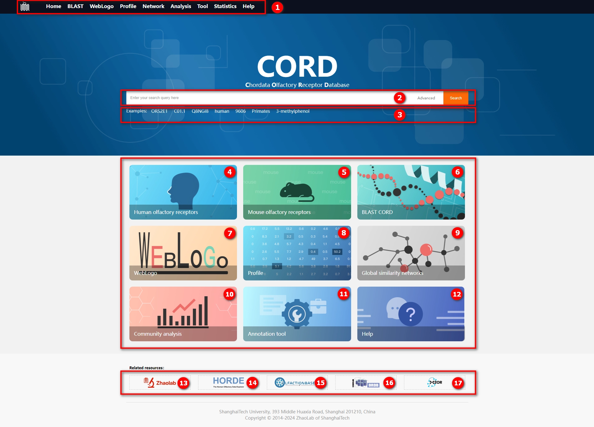
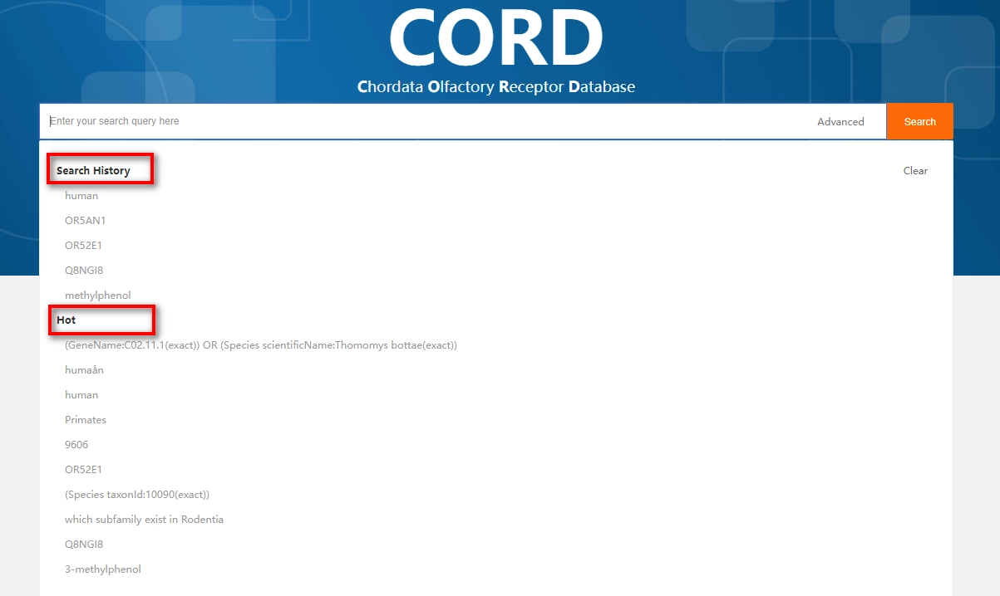

# 1.1 Home page

The following will introduce the main content of the CORD homepage.

    

① This section comprises nine menus in CORD, listed from left to right: 

| No.  | Menu name  | Description                                                  |
| ---- | ---------- | ------------------------------------------------------------ |
| 1    | Home       | Including the search box and main entry points to the database |
| 2    | BLAST      | Includes BLAST functionalities for both protein and DNA sequences |
| 3    | WebLogo    | Includes sequence logos for olfactory receptor families and species clades |
| 4    | Profile    | Includes residue distribution at various positions for olfactory receptors |
| 5    | Network    | Includes global sequence similarity network and a control panel |
| 6    | Analysis   | Includes tools for analyzing the relationships between olfactory receptor families and species clades |
| 7    | Tool       | Provides instructions on the usage of the olfactory receptor genome annotation tool and details about the algorithms |
| 8    | Statistics | Includes statistical information for various categories of data in CORD |
| 9    | Help       | Help documentation page, primarily covering the usage of the database and an introduction to the data |

② This section features the database search box, where users can enter search terms and click the "Search" button on the right side of the search box, or press the Enter key on the keyboard to perform a fuzzy search of the database. In addition, the "Advanced" button provides advanced search functionality, allowing users to conduct precise searches on specific fields. The names and descriptions of searchable fields are outlined in the table below:

| No.  | Field name       | Description                                                  | Example                                                      |
| ---- | ---------------- | ------------------------------------------------------------ | ------------------------------------------------------------ |
| 1    | Entry            | The unique identifier for each olfactory receptor in this database | MUBTIYF                                                      |
| 2    | Gene Name        | Identifier for gene level in our classification system       | C05.27.1                                                     |
| 3    | Organism         | The unique name for an organism such that two people can be sure that they are referring to the same organism | [Homo sapiens](https://www.ncbi.nlm.nih.gov/Taxonomy/Browser/wwwtax.cgi?mode=Info&id=9606) |
| 4    | UniProt          | The unique identifier for a protein in the UniProt database  | Q15619                                                       |
| 5    | External Name    | The gene name as documented in the UniProt database          | OR1C1                                                        |
| 6    | Gene Family      | Identifier for gene family level in our classification system | C05                                                          |
| 7    | Gene Subfamily   | Identifier for gene subfamily level in our classification system | C05.27                                                       |
| 8    | Gene Clade       | Identifier for gene clade level in our classification system | C05.27.1.Eu                                                  |
| 9    | Organism ID      | The unique identifier assigned by the NCBI to the source organism | [9606](https://www.ncbi.nlm.nih.gov/Taxonomy/Browser/wwwtax.cgi?mode=Info&id=9606) |
| 10   | Common Name      | The species common name                                      | human                                                        |
| 11   | Assembly ID      | The unique identifier for genomic assembly data in the NCBI database | [GCF_000001405.40](https://www.ncbi.nlm.nih.gov/datasets/genome/GCF_000001405.40) |
| 12   | Genus            | NCBI Taxonomy lineage - Genus                                | Homo                                                         |
| 13   | Family           | NCBI Taxonomy lineage - Family                               | Hominidae                                                    |
| 14   | Order            | NCBI Taxonomy lineage - Order                                | [Primates](https://www.ncbi.nlm.nih.gov/Taxonomy/Browser/wwwtax.cgi?mode=Info&id=9443) |
| 15   | Class            | NCBI Taxonomy lineage - Class                                | [Mammalia](https://www.ncbi.nlm.nih.gov/Taxonomy/Browser/wwwtax.cgi?mode=Info&id=40674) |
| 16   | Odor PubChem CID | The identifier of olfactory molecules in the PubChem database | 5283345                                                      |
| 17   | Odor IUPAC       | International Union of Pure and Applied Chemistry (IUPAC)    | pentyl acetate                                               |
| 18   | Odor CAS         | A unique and unambiguous identifier for a specific substance that allows clear communication and, with the help of CAS scientists, links together all available data and research about that substance | 3913-81-3                                                    |

When the mouse cursor is placed within the search box area, a dropdown menu will appear, including two options: "Search History" and "Hot." The "Search History" displays the user's past 5 historical search terms, while "Hot" shows the top 10 most frequently used search terms by all CORD users. If desired, clicking the "Clear" button allows you to erase your search history.

    

③ 7 example search terms, clicking on any of them will automatically populate the search box.

④ Link to the search results page for human olfactory receptors.

⑤ Link to the search results page for mouse olfactory receptors.

⑥ Link to the <i>BLAST</i> page, providing the same functionality as the <i>BLAST menu</i>.

⑦ Link to the <i>WebLogo</i> page, providing the same functionality as the <i>WebLogo menu</i>.

⑧ Link to the <i>Profile</i> page, providing the same functionality as the <i>Profile menu</i>.

⑨ Link to the <i>Global similarity networks</i> page, providing the same functionality as the <i>Network menu</i>.

⑩ Link to the <i>Community analysis</i> page, providing the same functionality as the <i>Analysis menu</i>.

⑪ Link to the <i>Annotation tool</i> page, providing the same functionality as the <i>Tool menu</i>.

⑫ Link to the <i>Help</i> page, providing the same functionality as the <i>Help menu</i>.

⑬ ZhaoLab is the development unit of this database. Click on this link to visit the official ZhaoLab homepage.

⑭ Link to the homepage of the <i>HORDE</i> database. 

⑮ Link to the homepage of the <i>OlfactionBase</i> database. 

⑯ Link to the homepage of the <i>ORDB</i> database.

⑰ Link to the homepage of the <i>M2OR</i> database. 

