# 1.10 Olfactory receptor detail page

## Introduction

In CORD, each olfactory receptor is equipped with a dedicated details page designed to provide comprehensive information about the receptor from various perspectives.

## Basic Information

    

Presenting the crucial fundamental information of the receptor, chiefly comprising the following details:

* 
Entry: The unique identifier for each olfactory receptor in this database.

* 
Match Score: Scoring of the number of matched patterns. For details, please <a href="#/./2-DataIntroduction/2.20-PatternMatch.md">refer to here</a>.

* 
Gene Name: Identifier for gene level in our classification system.

* 
Pattern Match: If the pattern is matched in the sequence, the corresponding square is green, otherwise it is red. For details, please <a href="#/./2-DataIntroduction/2.20-PatternMatch.md">refer to here</a>.

* 
Gene Family: Identifier for gene family level in our classification system.

* 
Gene Subfamily: Identifier for gene subfamily level in our classification system.

* 
Functional/Pseudo: Indication of whether this entry is a functional olfactory receptor gene or a pseudogene.

* 
External Name: The gene name as documented in the UniProt database.

* 
Amino Acids: The count of amino acids in the protein sequence of this olfactory receptor entry.

* 
Annotation Date: The annotation date of this entry in the database.

* 
NCBI Taxonomy: The unique identifier assigned by the NCBI to the source organism.

* 
Organism: The unique name for an organism such that two people can be sure that they are referring to the same organism.

* 
Common Name: The species common name.

## Sequences

    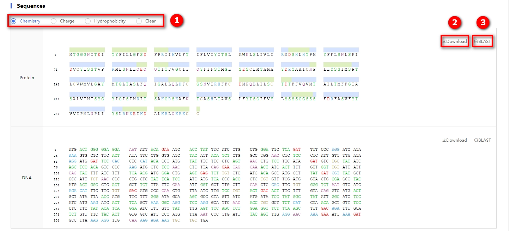

This section comprises a sequence display module designed specifically for showcasing the protein and DNA sequences associated with the receptor.

① Color Scheme Radio Button

* Chemistry: Coloring based on the chemical properties of amino acids.

| 
Propertie
 | 
Amino acid
 | 
Color
 |
| --------------------------------------- | ---------------------------------------- | ----------------------------------- |
| Polar                                   | G, S, T, Y, C                            | green      |
| Neutral                                 | Q, N                                     | purple    |
| Basic                                   | K, R, H                                  | blue        |
| Acidic                                  | D, E                                     | red          |
| Hydrophobic                             | A, V, L, I, P, W, F, M                   | black      |

* Charge: Coloring based on the charge properties of amino acids.

| 
Propertie
 | 
Amino acid
 | 
Color
 |
| --------------------------------------- | ---------------------------------------- | ----------------------------------- |
| Positive                                | K, R, H                                  | blue        |
| Negative                                | D, E                                     | red          |

* Hydrophobicity: Coloring based on the hydrophobic properties of amino acids.

| 
Propertie
 | 
Amino acid
 | 
Color
 |
| --------------------------------------- | ---------------------------------------- | ----------------------------------- |
| Hydrophilic                             | R, K, D, E, N, Q                         | blue        |
| Neutral                                 | S, G, H, T, A, P                         | green      |
| Hydrophobic                             | Y, V, M, C, L, F, I, W                   | black      |

* Clear: Clear the color scheme.

② Download sequence button.

③ Shortcut button to navigate to the BLAST page. This function will automatically import the sequence from the current page into the input box of BLAST.

## Snake Diagram

    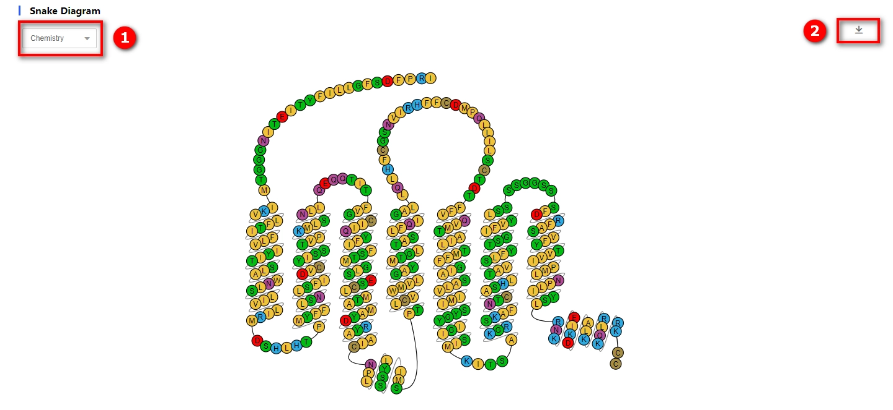

Snake diagram showing the main structural features of a olfactory receptor. The protein single-chain spans the cytoplasmic membrane via seven transmembrane helices (TM1-7), and it is characterized by three ECLs (ECL1-3) and three ICLs (ICL1-3), as well as a helical intracellular C terminus. For details, please <a href="#/./2-DataIntroduction/2.18-SnakeDiagram.md">refer to here</a>.

① Color Scheme Radio Button. The color schemes for Chemistry, Charge, and Hydrophobicity are identical to those of the Snake diagram.

* Coloring of the circles in the snake diagram is based on the properties of amino acids. There are three color schemes to choose from: Chemistry, Charge, and Hydrophobicity. The details of these schemes are identical to those outlined in the above "Sequence" 
* Binding pockets:  The predicted odor molecules bind to the pocket. In comparison to the previous version, this time we have incorporated structural information from OR51E2.
* OR .50: The residues at the OR generic residue numbering "X.50" in each transmembrane helical region.
* Class A GPCR .50: The residues at the class A GPCR generic residue numbering "X.50" in each transmembrane helical region.
* Clear: Remove the color scheme.

② Download image button.

## Structure

    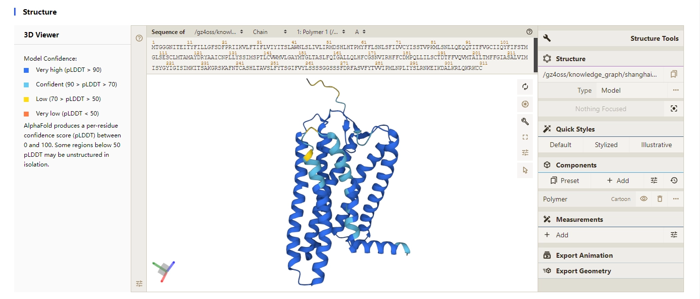

Protein structure module. For detailed instructions, please [refer to here](https://www.youtube.com/watch?v=bV3z4wWp-Ks).

    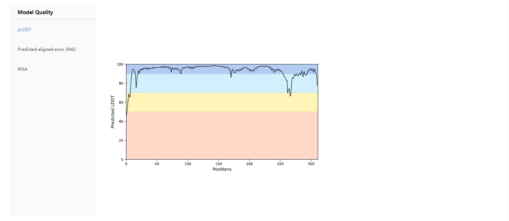

Protein structure module. Linear plot of the pLDDT scores for each residue of the receptor. The horizontal axis represents the amino acid positions, while the vertical axis represents the pLDDT values.

    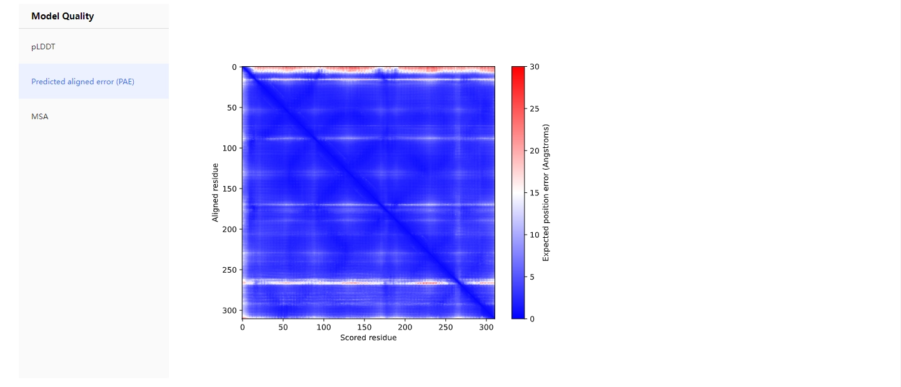

>
Independent of the 3D structure, AlphaFold produces an output called “Predicted Aligned Error” (PAE). This is shown at the bottom of structure pages as an interactive 2D plot.

>
>
The colour at (x, y) indicates AlphaFold’s expected position error at residue x if the predicted and true structures were aligned on residue y. If the PAE is generally low for residue pairs x, y from two different domains, it indicates that AlphaFold predicts well-defined relative positions and orientations for them. If the PAE is generally high for residue pairs x, y from two different domains, then the relative positions and/or orientations of these domains in the 3D structure are uncertain and should not be interpreted.

>
>---From [AlphaFoldDB](https://alphafold.ebi.ac.uk/)

    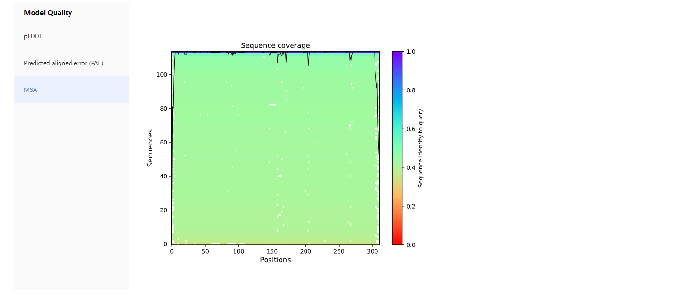

## Taxonomy

    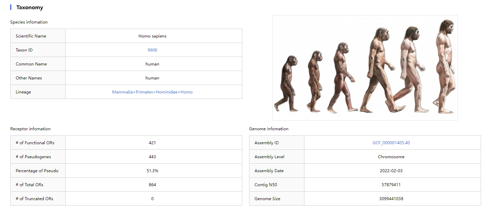

Information about the species to which the receptor belongs.

* Species infomation
  * 
Scientific Name: The unique name for an organism such that two people can be sure that they are referring to the same organism.

  * 
Taxon ID: The unique identifier assigned by the NCBI to the source organism

  * Common Name: The species common name.
  * Other Names: The alternative name for this species.
  * Lineage: Class -> Order -> Family -> Genes
* Receptor infomation
  * \# of Functional ORs: Number of functional olfactory receptor genes in the species.
  * \# of Pseudogenes: Number of olfactory receptor pseudogenes in the species
  * Percentage of Pseudo: The percentage of olfactory receptor pseudogenes.
  * \# of Total ORs: Total number of functional olfactory receptor genes and pseudogenes in the species.
  * \# of Truncated ORs: Number of truncated genes in the species.
* Genome infomation
  * 
Assembly ID: The unique identifier for genomic assembly data in the NCBI database.

  * 
Assembly Level: The highest level of genomic assembly for any object in the NCBI.

  * 
Assembly Date: The date of submission of the genomic assembly data to the NCBI.

  * 
Contig N50: Length such that sequence contigs of this length or longer include half the bases of the assembly.

  * 
Genome Size: Genome size, measured in terms of the number of base pairs.

In the upper right corner, an image representing the species to which the receptor belongs is displayed. For specific details regarding its source, please <a href="#/./2-DataIntroduction/2.3-DataDownload.md">refer to here</a>.

    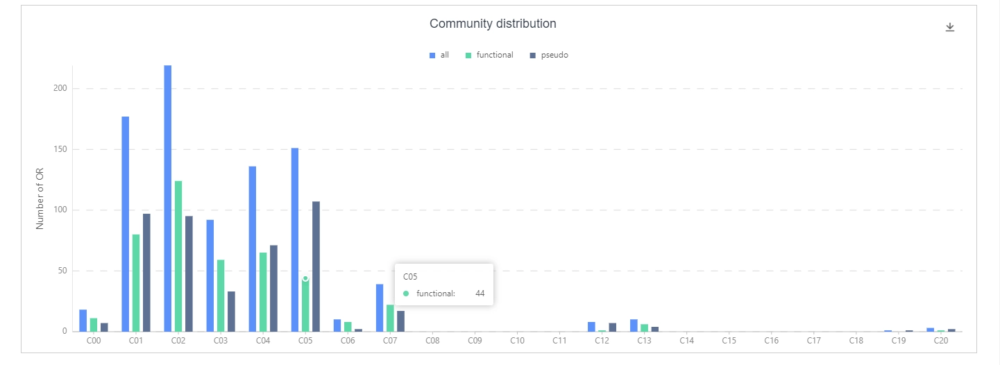

Bar chart depicting the receptor counts in various olfactory receptor subfamilies for this species, including functional olfactory receptors, olfactory receptor pseudogenes, and the total number of olfactory receptors. For details, please <a href="#/./2-DataIntroduction/2.6-CommunityDetection.md">refer to here</a>.

## Sequence Similar Network

    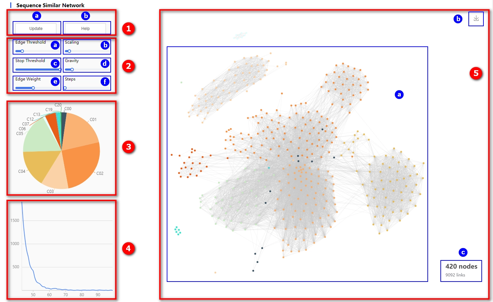

① Control button panel

* 
ⓐ Update Button: After adjusting the parameters, click this button to update the data.

* 
ⓑ Help Button: Click to navigate to the BLAST documentation page.

② Parameter panel.

* 
ⓐ Slider for adjusting edge weight threshold. Edges with values below this threshold will be filtered out.

* 
ⓑ The scaling factor of the layout. The larger the value, the greater the repulsive force between the nodes.

* 
ⓒ Stops the threshold of the layout and stops the layout when the global velocity factor of the layout is less than this threshold. Set to 0 to never stop.

* 
ⓓ The gravity that the node is subjected to. This force will make the nodes close to the center.

* 
ⓔ The weight distribution of the edges. Support is set to a single number, which is the uniform weight value.

* 
ⓕ The number of iterations of an update. Because the force-guided algorithm usually draws the results of each iteration, but because the drawing time tends to be greater than the layout time, the layout efficiency will be reduced. At this time, we can set a larger steps parameter to ensure the layout and Draw time equalization and speed up the layout.

③ Pie chart illustrating the proportion of node categories.

④ Histogram depicting the distribution of edge weights.

⑤ Sequence Similar Network

* ⓐ Presentation Space
* ⓑ Download image button
* ⓒ Number of nodes and edges

For details regarding the calculation of sequence similarity, please [refer to here](./2-DataIntroduction/2.9-SequenceSimilarity.md).

## Similar Proteins

    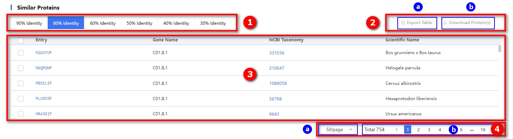

① Selection button for choosing similar proteins at different threshold levels.

② Export and download buttons.

* 
ⓐ Export Table Button: Users can select the desired data entries using the checkboxes and then click this button to export the table data.

* 
ⓑ Download Protein Sequences Button: Users can select the entries they wish to download protein sequences for by checking the corresponding boxes and then click the button to initiate the download.

③ Table of similar sequence information.

④ Page adjustment panel.

* 
ⓐ The dropdown menu for setting the number of rows displayed per page offers five options: 10, 20, 30, 50, and 100. By default, 20 rows are displayed per page.

* 
ⓑ Display the total number of results, along with buttons to navigate to specific pages.

For detailed information on the clustering of similar sequences, please [refer to here](./2-DataIntroduction/2.10-CORDclust.md).

## Ligands

    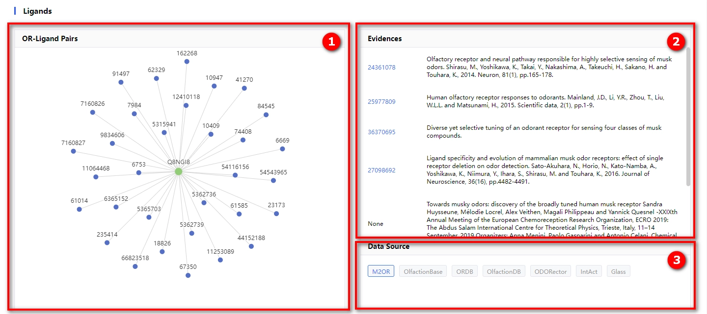

① Green nodes represent olfactory receptors; clicking on them allows access to the detailed page of the receptor in the UniProt database. Blue nodes represent odor molecules that have elicited a response in experiments with the corresponding olfactory receptor; clicking on them allows access to the detailed page of the molecule in the PubChem database.

② Original documents for data collection.

③ The sources from which we obtain the data.

Most olfactory receptors lack experimentally validated ligands; therefore, the detailed pages for these receptors do not include a "Ligands" module. For detailed steps regarding data collection, please [refer to here](./2-DataIntroduction/2.14-Odorants.md).

