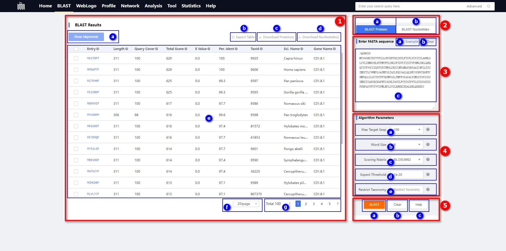

# 1.2 BLAST page

## Introduction

This page showcases the BLAST functionality developed based on the NCBI BLAST tool. It allows users to search for similar sequences in CORD, including protein and DNA sequences. For detailed information about BLAST and the construction of the CORD database, please <a href="#/./2-DataIntroduction/2.15-BLAST.md">refer to this link</a>.

    

① BLAST Search Results Table:

* 
ⓐ Display Sequence Alignment Button: This button shows the sequence alignment between the query sequence and the identified similar sequences in the BLAST search results.

* 
ⓑ OR Community Control Panel: After switching to this panel, you can choose WebLogo data for each olfactory receptor community. The olfactory receptor community here is equivalent to the olfactory receptor family data; for specific details, please <a href="#/./2-DataIntroduction/2.16-ORFamilyCommunity.md">refer to here</a>.

* 
ⓒ Download Protein Sequences Button: Users can select the entries they wish to download protein sequences for by checking the corresponding boxes and then click the button to initiate the download. Please note that this button is only available on the BLAST protein sequence page and is not functional on the BLAST DNA sequence page.

* 
ⓓ Download DNA Sequences Button: Users can select the entries they wish to download DNA sequences for by checking the corresponding boxes and then click the button to initiate the download. Please note that this button is only available on the BLAST DNA sequence page and is not functional on the BLAST protein sequence page.

* 
ⓔ BLAST Search Results Table. The meanings of each field in the table are as follows:

| No.  | 
Field
 | Description                                                  |
| ---- | ---------------------------------- | ------------------------------------------------------------ |
| 1    | Entry                              | The unique identifier for each olfactory receptor in this database |
| 2    | Length                             | The number of amino acids (nucleotides) in the protein (nucleic acid) sequence |
| 3    | Query Cover                        | The percent of the query length that is included in the aligned segments |
| 4    | Total Score                        | The sum of alignment scores of all segments from the same subject sequence |
| 5    | E Value                            | The number of alignments expected by chance with the calculated score or better. The expect value is the default sorting metric; for significant alignments the E value should be very close to zero |
| 6    | Per. Ident                         | The highest percent identity for a set of aligned segments to the same subject sequence |
| 7    | TaxId                              | The unique identifier assigned by the NCBI to the source organism |
| 8    | Sci. Name                          | The unique name for an organism such that two people can be sure that they are referring to the same organism |
| 9    | Gene Name                          | Identifier for gene level in our classification system       |

* 
ⓕ The dropdown menu for setting the number of rows displayed per page offers five options: 10, 20, 30, 50, and 100. By default, 20 rows are displayed per page.

* 
ⓖ Display the total number of BLAST search results, along with buttons to navigate to specific pages.

② BLAST Type Control Panel

* 
ⓐ BLAST Protein Panel: Search CORD protein database using a protein query.

* 
ⓑ BLAST Nucleotide Panel: Search CORD nucleotide database using a nucleotide query.

| 
BLAST type
 | 
Basic tool
 | 
Query sequence
 | 
Database
 |
| ---------------------------------------- | :--------------------------------------- | :------------------------------------------- | :------------------------------------- |
| BLAST Protein                            | blastn                                   | nucleotide                                   | CORD nucleotides                       |
| BLAST Nucleotide                         | blastp                                   | protein                                      | CORD proteins                          |

③ Input Sequence Panel:

* 
ⓐ Button for example sequences.

* 
ⓑ Button to clear the content in the text box below.

* 
ⓒ The query sequence to be used for a BLAST search should be pasted in this text area. These are described in 3) below. Accepted input types are FASTA and bare sequence. Please note that only one sequence can be entered for BLAST at a time. If you exceed this limit, you will receive a notification. The entered sequence will undergo a validity check, and if any illegal characters are present, a warning message will be displayed.

④ Control panel for BLAST algorithm parameters

The algorithm parameters for "BLAST Proteins" and "BLAST Nucleotides" are not entirely consistent. It is important to note that in the "BLAST Nucleotides" functionality, we do not provide the "Scoring Matrix" parameter.

* 
ⓐ Max Target Seqs: Select the maximum number of aligned sequences to display. Here, we provide several options: 10, 50, 100, 200, 500, 1000. The default selection is 100.

* 
ⓑ Word Size: The length of the seed that initiates an alignment. BLAST is a heuristic that works by finding word-matches between the query and database sequences. One may think of this process as finding “hot-spots” that BLAST can then use to initiate extensions that might eventually lead to full-blown alignments. For nucleotide-nucleotide searches (i.e., “blastn”) an exact match of the entire word is required before an extension is initiated, so that one normally regulates the sensitivity and speed of the search by increasing or decreasing the word-size. For other BLAST searches non-exact word matches are taken into accountbased upon the similarity between words. The amount of similarity can be varied. The webpage allows the word-sizes 2, 3, 5, and 6.

* 
ⓒ Scoring Matrix: Assigns a score for aligning pairs of residues, and determines overall alignment score. We offer two series of scoring matrices: BLOSUM and PAM. In the BLOSUM series, we provide the following scoring matrices: BLOSUM45, BLOSUM45, BLOSUM50, BLOSUM80, and BLOSUM90. In the PAM series, we offer PAM30, PAM70, and PAM250. The default scoring matrix is BLOSUM62. For detailed information about the BLOSUM matrix, please <a href="#/./2-DataIntroduction/2.19-BLOSUMmatrix.md">refer to here</a>.

* 
ⓓ Expect Threshold: This setting specifies the statistical significance threshold for reporting matches against database sequences. The default value (10) means that 10 such matches are expected to be found merely by chance, according to the stochastic model of Karlin and Altschul (1990). If the statistical significance ascribed to a match is greater than the EXPECT threshold, the match will not be reported. Lower EXPECT thresholds are more stringent, leading to fewer chance matches being reported.

* 
ⓔ Restrict Taxonomy: Restrict search of database to include only the specified taxonomy ID(s). If there are multiple taxonomy IDs to input, please use a comma as the separator.

⑤ Execution Panel

* ⓐ BLAST Button: Click to execute the BLAST program.
* ⓑ Clear Button: Click to clear the contents in the search result list.
* ⓒ Help Button: Click to navigate to the BLAST documentation page.

## Tutorial Video

    <video src="../data/3-videos/2.1-blast.mp4" width="100%" controls needTransformUrl="true" ></video>

