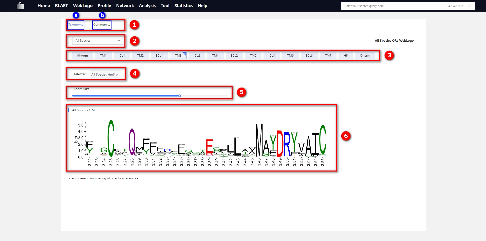

# 1.3 WebLogo page

## Introduction

Introduction to various functions on the WebLogo page. For details on the construction of WebLogo, please <a href="#/./2-DataIntroduction/2.13-WebLogo.md">refer to this page</a>.

    

① Switch Panel

* 
ⓐ Species Clade Control Panel: After switching to this panel, you can select WebLogo data for various species clades. The species clade data here is sourced from the <a target="_blank" href="https://www.ncbi.nlm.nih.gov/taxonomy">NCBI Taxonomy</a> database.

* 
ⓑ OR Community Control Panel: After switching to this panel, you can choose WebLogo data for each olfactory receptor community. The olfactory receptor community here is equivalent to the olfactory receptor family data; for specific details, please <a href="#/./2-DataIntroduction/2.16-ORFamilyCommunity.md">refer to here</a>.

② The species clade or OR community dropdown menu is utilized for selecting more detailed classification data.

③ Panel for selecting different regions of olfactory receptor structures. The panel is arranged from left to right in the order of olfactory receptor structure from the N-terminus to the C-terminus.

| No.  | Region | Full name             | Region Length |
| ---- | ------ | --------------------- | ------------- |
| 1    | N-term | N-terminal            | X             |
| 2    | TM1    | Transmembrane helix 1 | 28            |
| 3    | ICL1   | Intracellular loop 1  | 6             |
| 4    | TM2    | Transmembrane helix 2 | 29            |
| 5    | ECL1   | Extracellular loop 1  | 7             |
| 6    | TM3    | Transmembrane helix 3 | 34            |
| 7    | ICL2   | Intracellular loop 2  | 10            |
| 8    | TM4    | Transmembrane helix 4 | 26            |
| 9    | ECL2   | Extracellular loop 2  | 29            |
| 10   | TM5    | Transmembrane helix 5 | 34            |
| 11   | ICL3   | Intracellular loop 3  | 4             |
| 12   | TM6    | Transmembrane helix 6 | 32            |
| 13   | ECL3   | Extracellular loop 3  | 6             |
| 14   | TM7    | Transmembrane helix 7 | 24            |
| 15   | H8     | Helix 8               | 16            |
| 16   | C-term | C-terminal            | X             |

④ Selected Labels: Selected area labels. To deselect, click the cross icon at the end of the label.

⑤ Size Control Slider: If you find the size of the WebLogo inappropriate, you can adjust it by sliding the slider to the left to reduce the size or to the right to enlarge it.

⑥ WebLogo Display Area

## Tutorial Video

    <video src="../data/3-videos/3.1-weblogo.mp4" width="100%" controls needTransformUrl="true"></video>

