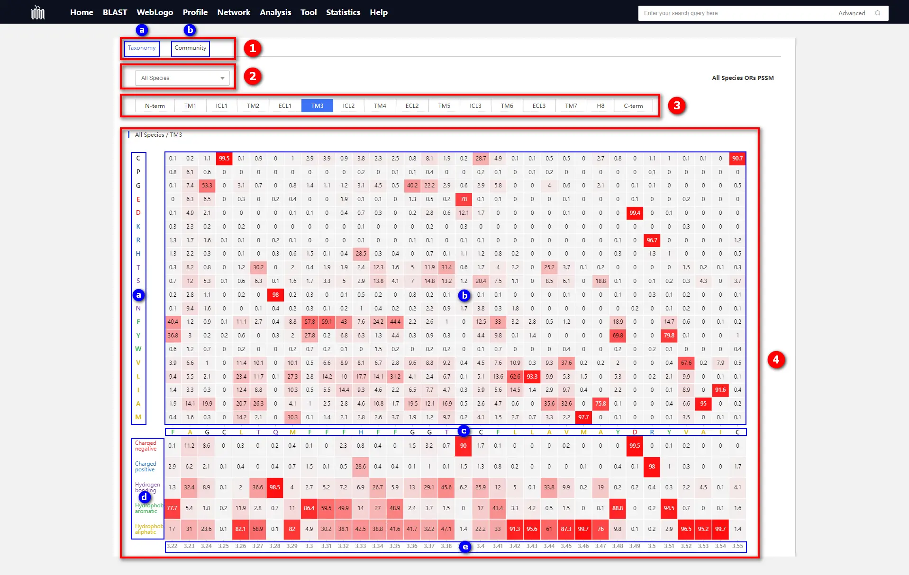

# 1.4 Profile page

## Introduction

Introduction to various functions on the Profile page. For details on the construction of Profile, please [refer to this page](./2-DataIntroduction/2.12-Profile.md).

    

① Switch Panel

* 
ⓐ Species Clade Control Panel: After switching to this panel, you can select Profile data for various species clades. The species clade data here is sourced from the <a target="_blank" href="https://www.ncbi.nlm.nih.gov/taxonomy">NCBI Taxonomy</a> database.

* 
ⓑ OR Community Control Panel: After switching to this panel, you can choose WebLogo data for each olfactory receptor community. The olfactory receptor community here is equivalent to the olfactory receptor family data; for specific details, please <a href="#/./2-DataIntroduction/2.16-ORFamilyCommunity.md">refer to here</a>.

② The species clade or OR community dropdown menu is utilized for selecting more detailed classification data.

③ Panel for selecting different regions of olfactory receptor structures. The panel is arranged from left to right in the order of olfactory receptor structure from the N-terminus to the C-terminus. For detailed information regarding each selection panel, please <a href="#/./2-DataIntroduction/1.3-WebLogo.md">refer to here</a>.

④ Profile Display Area

* ⓐ 20 categories of natural amino acids.

* 
ⓑ At specific positions, the percentage of specific residues relative to the total residue count.

* ⓒ Consensus sequence

* 
ⓓ The residue combination classified based on the chemical properties of amino acids.

  
  * Charged negative: {D, E}
  * Charged  positive: {K, R, H}
  * Hydrogen bonding: {T, S, Q, N}
  * Hydrophobic aromatic: {F, Y, W}
  * Hydrophobic aliphatic: {V, L, I, A, M}
  
* 
ⓔ Generic residue numbering. For specific details, please <a href="#/./2-DataIntroduction/2.7-GenericResidueNumbering.md">refer to here</a>.

## Tutorial Video

    <video src="../data/3-videos/4.1-profile.mp4" width="100%" controls needTransformUrl="true"></video>

