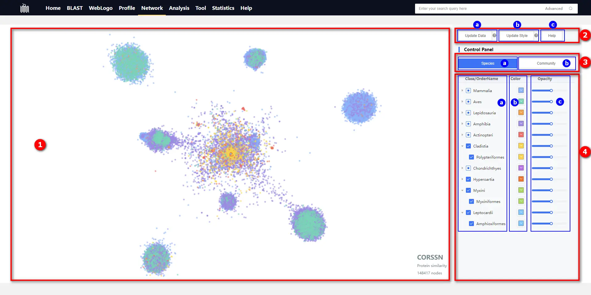
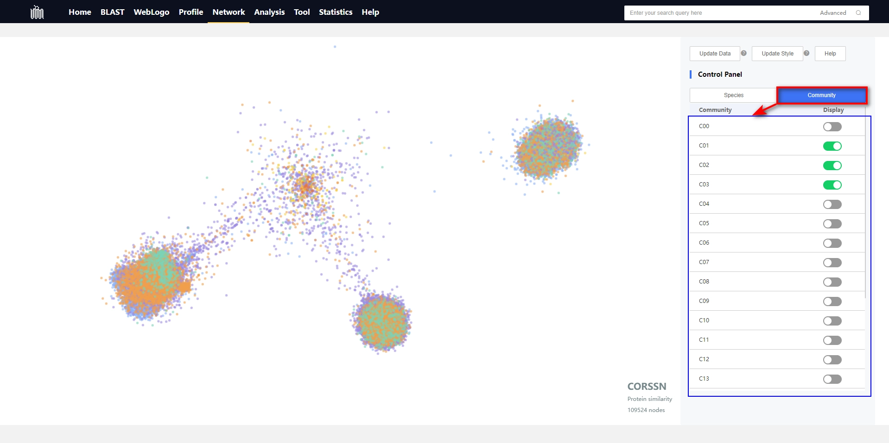

# 1.5 Network page

## Introduction

Introduction to various functions on the Network page. For details on the construction of Profile, please [refer to this page](./2-DataIntroduction/2.6-CommunityDetection.md).

    

① Presentation Space: 

* 
Each point in this area represents an olfactory receptor.

* 
When the mouse hovers over a point, it will provide information about the olfactory receptor represented by that point.

* 
Clicking on any point allows you to access the details page of the corresponding olfactory receptor.

* 
The mouse scroll wheel is used to control the zoom in and out of the viewing area.

* 
Holding down the left mouse button while simultaneously moving the mouse allows you to adjust the viewing angle of the visualization.

* 
Pressing and holding the mouse wheel while moving the mouse allows for panning the view.

* 
At the bottom right corner of the view displays the number of data points currently loaded in the visualization.

② Data and Style Update Control Panel:

* 
ⓐ Update Data Button: When you newly select or deselect data points in the 'Control Panel,' please click the button to update the data in the 'Presentation Space'.

* 
ⓑ Update Style Button: When you make new style modifications to data points in the 'Control Panel,' please click the button to update the data styles (including color and opacity) in the 'Presentation Space'.

* 
ⓒ Help Button: Click to navigate to the BLAST documentation page.

Emphasizing that the "Update Data" button includes the functionality of the "Update Style" button, whereas the "Update Style" button does not include the functionality of the "Update Data" button. If you only modify the style of data points (including color and opacity), we strongly recommend using the "Update Style" button to update the styles of data points in the 'Presentation Space' . Although achieving this through the "Update Data" button is possible, we advise against it because the "Update Data" button checks for changes in data points, potentially imposing a greater burden on the browser and requiring a longer waiting time.

③ Switch Panel

* 
ⓐ Species Clade Control Panel: After switching to this panel, you can select data for various species clades. The species clade data here is sourced from the <a target="_blank" href="https://www.ncbi.nlm.nih.gov/taxonomy">NCBI Taxonomy</a> database.

* 
ⓑ OR Community Control Panel: After switching to this panel, you can choose data for each olfactory receptor community. The olfactory receptor community here is equivalent to the olfactory receptor family data; for specific details, please <a href="#/./2-DataIntroduction/2.16-ORFamilyCommunity.md">refer to here</a>.

  

      
  

④ Data Selection and Style Modification Panel

* 
ⓐ Select or deselect data through checkboxes. There are two levels of selection: the first level corresponds to the class-level species classification in the <a target="_blank" href="https://www.ncbi.nlm.nih.gov/taxonomy">NCBI Taxonomy</a> database, and the second level corresponds to the order-level species classification. Upon checking the checkbox, the olfactory receptor data points corresponding to the selected species classification will be chosen; conversely, unchecking the checkbox will deselect the olfactory receptor data points corresponding to the respective species classification. <b>Please be aware that after completing the selection, it is necessary to click the 'Update Data' button to refresh the dataset.</b>

  
* 
ⓑ Color Adjustment Panel. You can easily modify the colors of data points through this panel to meet personalized visual and analytical requirements. <b>Please note that, after adjusting the colors, you need to click the 'Update Style' or 'Update Data' button to refresh the style.</b>

* 
ⓒ Opacity Adjustment Panel. You can easily adjust the transparency of data points through this panel to meet personalized visual and analytical requirements. <b>Please note that, after adjusting the opacity, you need to click the 'Update Style' or 'Update Data' button to refresh the style.</b>

## Tutorial Video

    <video src="../data/3-videos/5.1-network.mp4" width="100%" controls needTransformUrl="true"></video>

