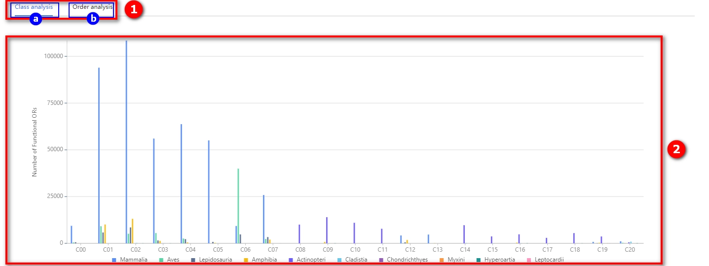
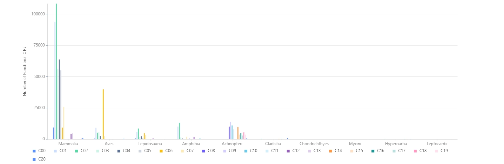
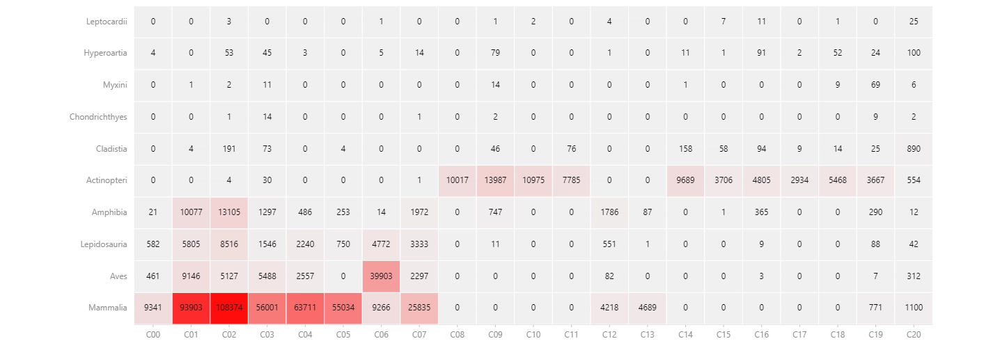
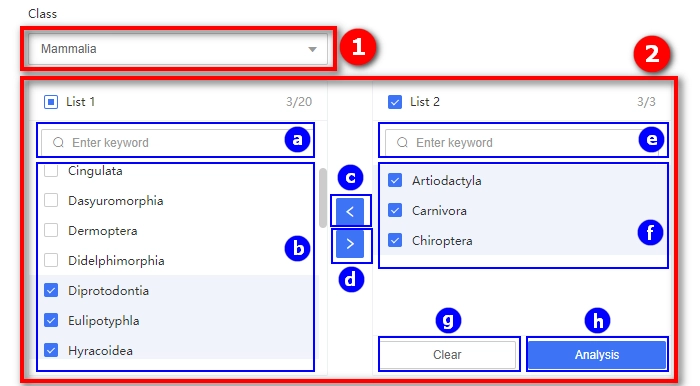

# 1.6 Analysis page

## Introduction

The analysis page for the distribution of olfactory receptor quantities.

**The analysis page for class (taxonomic rank)**

    

① Species Clade Switch Panel

* ⓐ The button for selecting taxonomic class clades of species.
* ⓑ The button for selecting taxonomic order clades of species.

② The distribution of olfactory receptor quantities across various communities.

* horizontal axis represents various olfactory receptor communities;
* vertical axis indicates the quantity of functional olfactory receptors;
* different colors represent distinct class (taxonomic rank);
* <b>clicking on the legend allows for the removal or addition of data in the chart.</b>

    

The distribution of olfactory receptor quantities across various class (taxonomic rank).

* horizontal axis represents various class  (taxonomic rank);
* vertical axis indicates the quantity of functional olfactory receptors;
* different colors represent distinct olfactory receptor communities;
* <b>clicking on the legend allows for the removal or addition of data in the chart.</b>

    

The heatmap illustrating the distribution of olfactory receptor quantities.

* horizontal axis represents various olfactory receptor communities;
* vertical axis represents various class  (taxonomic rank);
* The numbers in the table represent the quantity of functional olfactory receptors.

**The analysis page for order (taxonomic rank)**

    

① The dropdown menu for selecting class.  Upon selection, the orders under this class will appear on the left side of the shuttle box below for further selection (② -> ⓑ ). The default choice is "All".

② Transfer Box

* ⓐ Search Box: Search for content in ⓑ
* ⓑ The checkbox on the left, containing all available options.
* 
ⓒ The shuttle button is used to transfer the selected content from the checkbox on the right to the checkbox on the left.

* 
ⓓ The transfer button is used to move the selected content from the checkbox on the left to the checkbox on the right.

* ⓔ Search Box. Search for content in ⓕ
* ⓕ All content transferred from the left checkbox, by default, is empty.
* ⓖ Clear Button: Clear all content in the checkbox on the right.
* ⓗ Analysis Button: Analyze all selected content in the checkbox on the right.

## Tutorial Video

    <video src="../data/3-videos/6.1-analysis.mp4" width="100%" controls needTransformUrl="true"></video>

