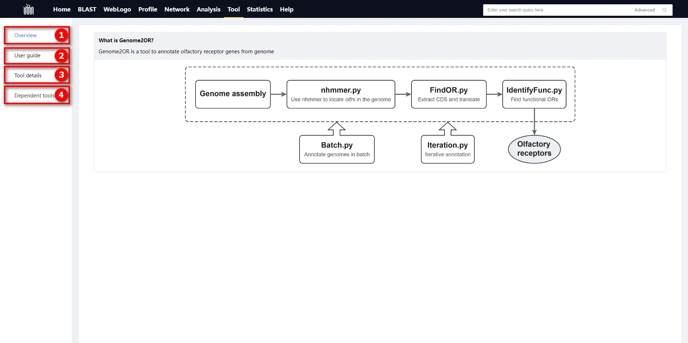

# 1.7 Tool page

## Introduction

Mainly, this section introduces our self-developed olfactory receptor genome annotation tool named Genome2OR, including details on downloading and installing, instructions for use, and algorithmic workflow specifics.

    

① Overview diagram of the workflow of Genome2OR.

② Operation and user guide for the Genome2OR.

③ The algorithmic flowchart of Genome2OR.

④ The dependencies of Genome2OR.