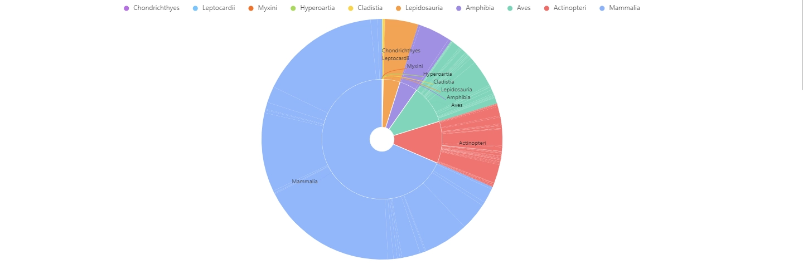
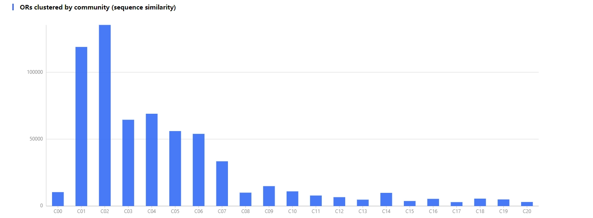
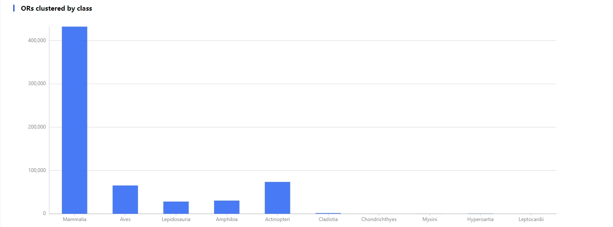
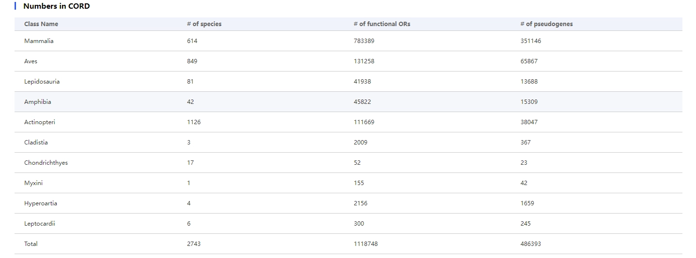
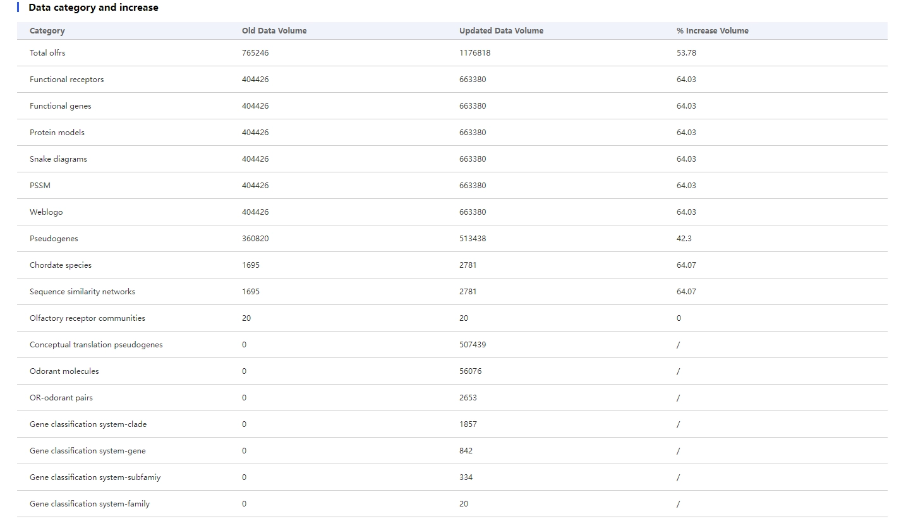

# 1.8 Statistics page

## Introduction

The 'Statistics' page serves as a summary of data in CORD, primarily detailing the quantity and distribution of various data categories.

    

The distribution of species in the CORD database. The content can be removed or added from the graph by clicking on the legend.

    

Histogram of the distribution of olfactory receptors in the olfactory receptor communities of the CORD database, where the x-axis represents various receptor communities, and the y-axis represents the number of olfactory receptors.

    

Histogram of the distribution of olfactory receptor numbers in species clade in the CORD database, where the x-axis represents the species clade of olfactory receptors, and the y-axis represents the number of olfactory receptors.

    

CORD database's overview of basic data for various species clades. The first column represents the species clade, the second column indicates the number of species included in this clade in CORD, the third column shows the quantity of functional olfactory receptors within this species clade in CORD, and the fourth column represents the number of olfactory receptor pseudogenes within this species clade in CORD.

    

Summary of Data Volume in the CORD Database. The first column represents the data category, the second column indicates the data volume in the old version of the database, the third column represents the data volume in the current version of the database, and the fourth column denotes the data growth in the current version relative to the old version of the database.
