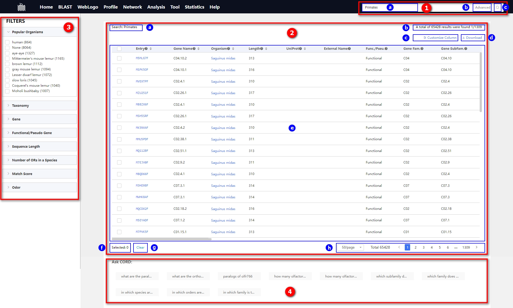

# 1.9 Search result page

## Introduction

In this information-rich database, you can effortlessly search for and retrieve the data you need. Our search page offers powerful and flexible tools to help you quickly locate your targets, discover related information, and delve into various aspects of the data. 

**Key Features**:

1. 
<b>Intelligent Search:</b> Utilize advanced search technology to input keywords, phrases, or conditions, obtaining precise results related to your topics of interest.

2. 
<b>Diverse Filtering Options:</b> Employ flexible filters to refine search results, ensuring the display of information that meets your specific criteria such as data types, time ranges, and other conditions.

3. 
<b>Interactive Result Presentation:</b> Display search results in an intuitive manner, utilizing charts, tables, and other visualization tools to facilitate a more straightforward understanding and analysis of the data.

    

①  Search box:

* 
ⓐ Text input box, used for entering keywords, phrases, or search criteria. 

* 
ⓑ The advanced button is employed to offer enhanced search options and customization features, meeting users' demands for more precise control over their searches. Users can incorporate additional conditions or filters when conducting complex queries.

  
<b>Logical Operators: </b> Users can utilize the advanced button to add logical operators, such as AND, OR, NOT, to construct more complex query statements, further refining their searches.

  
<b>Field Selection:</b>  Some advanced search functionalities enable users to choose specific fields for their searches, ensuring that their queries are confined to the areas of interest.

  
<b>Search Type:</b> Users have the option to choose between precise and fuzzy search, allowing them to control the scope of their searches.

  

      
  

* 
ⓒ Search Button: Users click on this button to execute the entered query.

②  The search results table is a tabular presentation designed to display the outcomes of a search query in a structured format, showcasing the information desired by users.

* 
ⓐ Display Search Terms

* 
ⓑ Display the total number of search results and the overall page count.

* 
ⓒ Customization Button: Users can customize the display and visibility of fields using this button.

  

      
  

* 
ⓓ Download Button: Used to retrieve data.

  

      
  

* 
ⓔ Search Results Table.

| No.  | Field            | Sortable | Description                                                  |
| ---- | ---------------- | -------- | ------------------------------------------------------------ |
| 1    | Entry            | yes      | the unique identifier for each olfactory receptor in this database |
| 2    | Gene Name        | yes      | Identifier for gene level in our classification system       |
| 3    | Organism         | yes      | the unique name for an organism such that two people can be sure that they are referring to the same organism |
| 4    | Length           | yes      | the count of amino acids in the protein sequence of this olfactory receptor entry |
| 5    | UniProt          | yes      | the unique identifier for a protein in the UniProt database  |
| 6    | External Name    | no       | the gene name as documented in the UniProt database          |
| 7    | Func./Pseu.      | no       | indication of whether this entry is a functional olfactory receptor gene or a pseudogene |
| 8    | Gene Fam.        | no       | Identifier for gene family level in our classification system |
| 9    | Gene SubFam.     | no       | Identifier for gene subfamily level in our classification system |
| 10   | Gene Clade       | no       | Identifier for gene clade level in our classification system |
| 11   | Pattern Match    | no       | If the pattern is matched in the sequence, the corresponding square is green, otherwise it is red. |
| 12   | Match Score      | no       | scoring of the number of matched patterns                    |
| 13   | Organism ID      | no       | the unique identifier assigned by the NCBI to the source organism |
| 14   | Common Name      | no       | the species common name                                      |
| 15   | Func. No.        | yes      | number of functional olfactory receptor genes in the species |
| 16   | Pseu. No.        | yes      | number of olfactory receptor pseudogenes in the species      |
| 17   | Total No.        | yes      | total number of functional olfactory receptor genes and pseudogenes in the species |
| 18   | Per. Pseu.       | yes      | the percentage of olfactory receptor pseudogenes             |
| 19   | Trunc. No.       | yes      | number of truncated genes in the species                     |
| 20   | Assembly ID      | no       | the unique identifier for genomic assembly data in the NCBI database |
| 21   | Contig N50       | no       | length such that sequence contigs of this length or longer include half the bases of the assembly |
| 22   | Ass. Level       | no       | the highest level of genomic assembly for any object in the NCBI |
| 23   | Genome Size      | no       | genome size, measured in terms of the number of base pairs   |
| 24   | Ass. Date        | no       | the date of submission of the genomic assembly data to the NCBI |
| 25   | Genus            | no       | NCBI Taxonomy lineage - Genus                                |
| 26   | Family           | no       | NCBI Taxonomy lineage - Family                               |
| 27   | Order            | no       | NCBI Taxonomy lineage - Order                                |
| 28   | Class            | no       | NCBI Taxonomy lineage - Class                                |
| 29   | Echotype         | no       | a genetically distinct geographic variety, population, or race within a species, which is genotypically adapted to specific environmental conditions |
| 30   | Anno. Date       | no       | the annotation date of this entry in the database            |
| 31   | Odor PubChem CID | no       | the identifier of olfactory molecules in the PubChem database |
| 32   | Odor IUPAC       | no       | International Union of Pure and Applied Chemistry (IUPAC)    |
| 33   | Odor CAS         | no       | a unique and unambiguous identifier for a specific substance that allows clear communication and, with the help of CAS scientists, links together all available data and research about that substance |
| 34   | Odor Type        | no       |                                                              |
| 35   | Odor Strength    | no       |                                                              |

* 
ⓕ The number of selected entries.

* 
ⓖ Button to clear selected entries.

* 
ⓗ Display the total number of BLAST search results, along with buttons to navigate to specific pages.

③  Filter Panel.

Filter conditions are settings or rules within a database used to screen and refine data. Users employ filter conditions to restrict query results, displaying only the data that meets specific criteria.

* Popular Organisms

  
Filtering based on the common names of species, with priority given to popular species such as human, house mouse, dog, zebrafish, etc. Other species are displayed in order of the number of entries found in the search results, with a maximum of 10 results displayed.

* Taxonomy

  
Filtering based on fields relevant to taxonomy, such as , <i>Taxonomy ID</i>, <i>Scientific Name</i>, <i>Common Name</i>, <i>Genus</i>, <i>Family</i>, <i>Order</i>, <i>Class</i>, and others.

* Gene

* Functional/Pseudo Gene

* Sequence Length

* Number of ORs in a Species

* Match Score

* Odor

④  Sentence Search Example. "Sentence Search" is a powerful search tool that allows users to input search queries in the form of complete sentences or phrases to obtain more accurate results.

