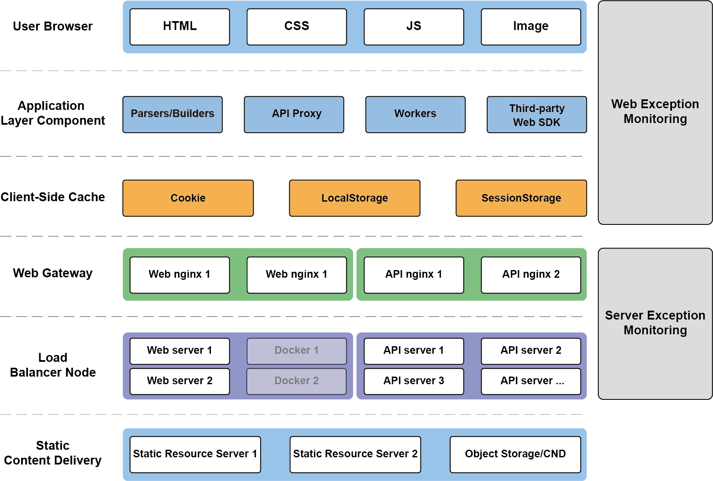
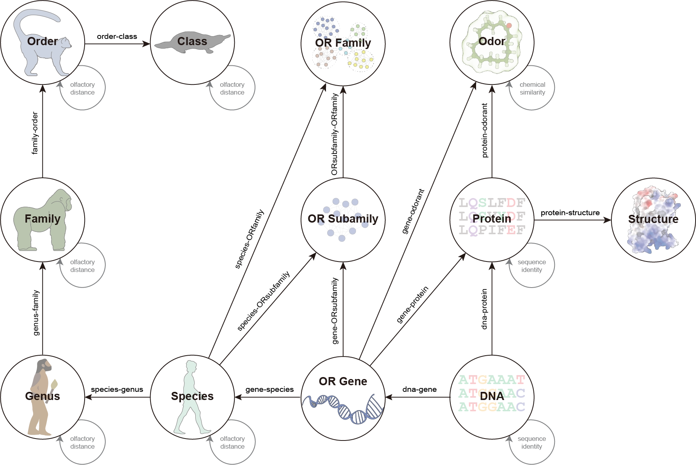

# 2.1 Database architecture

## Frontend framework

The frontend framework for the CORD knowledge graph is described in the following diagram.

    

The frontend caching status is presented in the table below:

* HTML: disable cache
* CSS: not less than 2 weeks
* JS: not more than 2 weeks
* Image/Video: not less than 1 month

## Knowledge graph framework

The data foundation of CORD is built upon the Intelligent Biological Knowledge Graph developed by <a target="_blank" href="https://www.ctyun.cn/">China Telecom Cloud Technology Co., Ltd.</a> This graph, based on the open-source graph database Nebula Graph, stores vast amounts of graphical network data, enabling comprehensive retrieval and analysis of graph information. The data organization is achieved through six fundamental data models for storage and retrieval, as outlined below:

<b>1. Graph space (Space):</b> Graph Space is used to isolate data from different teams or projects. Data in different graph spaces is mutually isolated, allowing for the specification of different storage replication levels, permissions, sharding, etc.

<b>2. Vertex (Point):</b> A vertex is used to store entity objects and is identified by a VID, which is unique within the same graph space.

<b>3. Edge:</b> Edges connect vertices, representing relationships or actions between two points. An edge can be multi-edged between two points and has directionality. It is uniquely identified by a quadruple <Start VID, Edge type, Edge rank, End VID> (Rank can be used to differentiate edges with the same Edge type, start point, and end point. This value is entirely specified by the user.). An edge has only one Edge type.</Start>

<b>4. Edge type:</b> Edge type is composed of a predefined set of attributes and serves as a concrete description of an edge. For example, the edge type from the node 'player' to 'team' can be defined as 'serve.'

<b>5. Property:</b> Properties are information represented in the form of key-value pairs and provide a set of descriptions for points or edges.

<b>6. Tag:</b> A tag is composed of a predefined set of attributes and serves as a concrete description of a point. Each point can have multiple tags. For instance, a point with VID=01 can simultaneously have multiple tags, such as 'player' and 'singer.

    

## Knowledge graph data summary

| No.  | Type         | Name                 | No. of Entries | No. of Attributes |
| ---- | ------------ | -------------------- | -------------- | ----------------- |
| 1    | Entity       | Structure            | 663,380        | 5                 |
| 2    | Entity       | Protein              | 1,170,819      | 13                |
| 3    | Entity       | DNA                  | 1,176,818      | 9                 |
| 4    | Entity       | Species              | 2,781          | 25                |
| 5    | Entity       | Genus                | 1,630          | 13                |
| 6    | Entity       | Family               | 590            | 12                |
| 7    | Entity       | Order                | 138            | 11                |
| 8    | Entity       | Class                | 10             | 10                |
| 9    | Entity       | Odor                 | 23,690         | 76                |
| 10   | Entity       | OR Gene              | 1,623          | 6                 |
| 11   | Entity       | OR Subfamily         | 334            | 3                 |
| 12   | Entity       | OR Family            | 22             | 2                 |
| 13   | Relationship | protein-protein      | 3,607,786,080  | 3                 |
| 14   | Relationship | protein-structure    | 663,380        | 3                 |
| 15   | Relationship | class-class          | 45             | 4                 |
| 16   | Relationship | order-order          | 253            | 4                 |
| 17   | Relationship | family-family        | 8,128          | 4                 |
| 18   | Relationship | genus-genus          | 70,125         | 4                 |
| 19   | Relationship | species-species      | 187,579        | 4                 |
| 20   | Relationship | species-genus        | 2,779          | 3                 |
| 21   | Relationship | genus-family         | 2,765          | 3                 |
| 22   | Relationship | family-order         | 2,733          | 3                 |
| 23   | Relationship | order-class          | 2,710          | 3                 |
| 24   | Relationship | protein-odorant      | 2,652          | 7                 |
| 25   | Relationship | odorant-odorant      | 217,156        | 7                 |
| 26   | Relationship | gene-dna             | 832,645        | 3                 |
| 27   | Relationship | gene-protein         | 829,766        | 3                 |
| 28   | Relationship | gene-odorant         | 987            | 3                 |
| 29   | Relationship | gene-species         | 332,098        | 3                 |
| 30   | Relationship | gene-ORsubfamily     | 1,623          | 3                 |
| 31   | Relationship | ORfamily-species     | 8,552          | 3                 |
| 32   | Relationship | ORsubfamily-ORfamily | 334            | 3                 |
| 33   | Relationship | ORsubfamily-species  | 131,262        | 3                 |
| 34   | Relationship | dna-protein          | 1,170,819      | 3                 |
| 35   | Relationship | dna-dna              | 2,721,914,364  | 2                 |

## Database Deployment

CORD is deployed on four high-performance cloud servers provided by the Library and Information Center of ShanghaiTech University. The deployment is managed by the professional team from <a target="_blank" href="https://www.ctyun.cn/">China Telecom Cloud Technology Co., Ltd.</a>, with the aim of ensuring the security and stability of the service.

1. Cloud Server Configuration

   
The operational environment of the database is based on four high-performance cloud servers, each exhibiting elevated capabilities in processing power, memory capacity, and storage space. Two servers are equipped with 8-core processors, 16GB of RAM, and a 500GB data disk each, serving the front-end and back-end functions of the database. The other two servers are configured with 16-core processors, 32GB of RAM, and a 1TB data disk each, handling storage and read-write services. This configuration guarantees the efficient operation of the database when dealing with large-scale data and requests.

2. Database Security

   
To ensure the security of data, we rely on the professional team of the Library and Information Center at ShanghaiTech University. This team possesses extensive experience and professional expertise, dedicating themselves to the maintenance of data security and system stability.

## Download entity

Clicking on the download link below allows you to download the corresponding entity data.

* Protein [⬇](/v2/graph/static/help/protein.zip)
* DNA [⬇](/v2/graph/static/help/DNA.zip)
* Species [⬇](/v2/graph/static/help/species.zip)
* Genus [⬇](/v2/graph/static/help/genus.zip)
* Family [⬇](/v2/graph/static/help/family.zip)
* Order [⬇](/v2/graph/static/help/order.zip)
* Class [⬇](/v2/graph/static/help/class.zip)
* Odor [⬇](/v2/graph/static/help/odor.zip)
* OR Gene [⬇](/v2/graph/static/help/gene.zip)
* OR Subfamily [⬇](/v2/graph/static/help/ORsubfamily.zip)
* OR Family [⬇](/v2/graph/static/help/ORfamily.zip)

