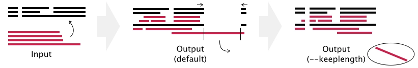

# 2.11 MSA in CORD

## MSA based on template MSA

In the assessment of sequence similarity, it is imperative to conduct multiple sequence alignments (MSA) for all protein sequences within CORD. CORD encompasses a dataset comprising 1.17 million protein sequences, consisting of 663,380 translated protein sequences from functional genes and 507,439 conceptually translated protein sequences from pseudogenes. Achieving precise multiple sequence alignments for such an extensive scale of protein sequences poses a challenging endeavor.

We utilized the <a target="_blank" href="https://mafft.cbrc.jp/alignment/software/algorithms/algorithms.html">MAFFT-LINSI</a> (v7.5) tool, known for its accuracy and speed in multiple sequence alignment. To achieve precise alignment for the 1.17 million CORD protein sequences, we employed the following strategies:

(1) performed multiple sequence alignment for 300 representative olfactory receptor protein sequences using MAFFT-LINSI. Subsequently, this alignment was utilized as the template alignment file.

(2) Divided the CORD sequences into random subsets, each containing 300 sequences.

(3) Used MAFFT's <a target="_blank" href="https://mafft.cbrc.jp/alignment/server/add.html"><i>--add</i> and <i>--keeplength</i></a> parameters to conduct multiple sequence alignment, utilizing the template alignment file as a reference.

(4) Merged the alignment results from each subset to finalize the CORD multiple sequence alignment.

**Example workflow:**

    

## Structure-based sequence alignment

In the process of numbering olfactory receptor sites, we employed a structure-based sequence alignment. The overall procedure involves three main steps: 

(1) utilizing the experimentally determined structure of the unique olfactory receptor, <a target="_blank" href="https://pubmed.ncbi.nlm.nih.gov/36922591/">OR51E2</a>, as a template structure;

(2) employing <a target="_blank" href="https://pychimera.readthedocs.io/en/latest/">PyChimera</a> to align the structure of each receptor in CORD with the template structure;

(3) exporting the sequence alignment based on the aligned structures.

We are required to perform 663,380 structure alignments, a task virtually impractical for graphical operations in Chimera. Here, we employ the PyChimera tool to automate the entire alignment process.

## Alternative methods for MSA

For various purposes, such as testing or conducting multiple sequence alignments for specific datasets, we employed multiple sequence alignment methods in the project. Specifically, we utilized tools such as <a target="_blank" href="http://www.clustal.org/omega/">Clustal Omega</a>, <a target="_blank" href="https://github.com/TimoLassmann/kalign">Kalign</a>, <a target="_blank" href="http://hmmer.org/">hmmalign</a>.

## Reference

Katoh K, Frith MC. Adding unaligned sequences into an existing alignment using MAFFT and LAST. <i>Bioinformatics</i>. 2012;28(23):3144-3146.

Billesbølle CB, de March CA, van der Velden WJC, et al. Structural basis of odorant recognition by a human odorant receptor. <i>Nature</i>. 2023;615(7953):742-749.

Rodríguez-Guerra Pedregal J, Maréchal JD. PyChimera: use UCSF Chimera modules in any Python 2.7 project. <i>Bioinformatics</i>. 2018;34(10):1784-1785.

Sievers F, Higgins DG. Clustal Omega for making accurate alignments of many protein sequences. <i>Protein Sci</i>. 2018 Jan;27(1):135-145.

Mirdita M, von den Driesch L, Galiez C, Martin MJ, Söding J, Steinegger M. Uniclust databases of clustered and deeply annotated protein sequences and alignments. <i>Nucleic Acids Res</i>. 2017;45(D1):D170-D176.

