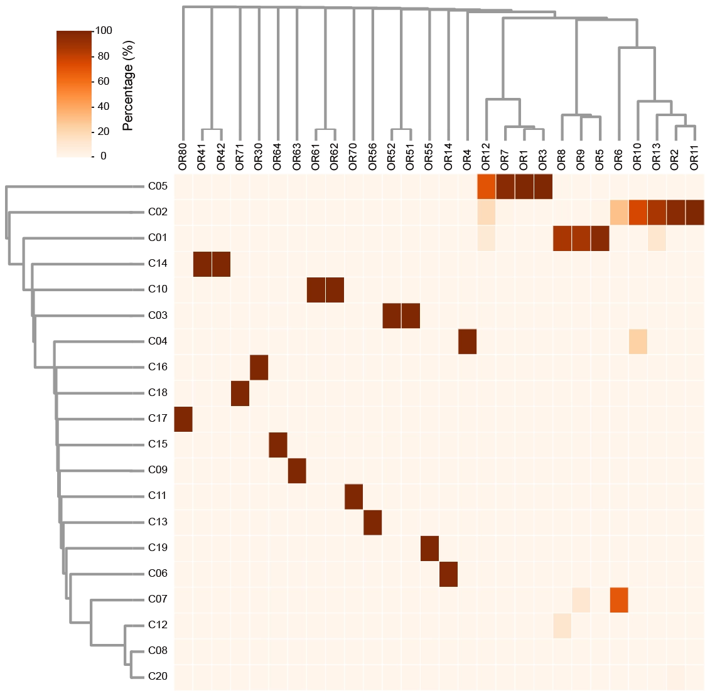

# 2.16 OR family and community

## Introduction

This page showcases the BLAST functionality developed based on the NCBI BLAST tool. It allows users to search for similar sequences in CORD, including protein and DNA sequences. For detailed information about BLAST and the construction of the CORD database, please <a href="#/./2-DataIntroduction/2.15-BLAST.md">refer to this link</a>.

In CORD, the allocation of olfactory receptor communities introduces an additional layer of description for olfactory receptors. Specifically, in situations where the unified naming system cannot be applied, approximately two-thirds of functional olfactory receptors in CORD fall into this category. When mapping several dozen olfactory receptor families to 20 communities, most olfactory receptor families can be clearly mapped to a specific olfactory receptor community. However, there are instances where multiple olfactory receptor families are mapped to the same olfactory receptor community. For example, OR5, OR8, and OR9 are all mapped to the C01 community, consistent with previous reports indicating that OR5, OR8, and OR9 constitute a single olfactory receptor family in mammals, with their expansion related to the adaptation of herbivores to their environment. Similar situations occur with OR1, OR3, OR7, and OR12, all mapped to the C05 community. Additionally, OR2/10/11/13, OR41/42, OR51/52, OR61/62 are respectively mapped to C02, C14, C03, and C10. 

For detailed information on the partitioning of olfactory receptor communities, please [refer to this](./2-DataIntroduction/2.6-CommunityDetection.md).

    

## Reference

Olender T, Jones TEM, Bruford E, Lancet D. A unified nomenclature for vertebrate olfactory receptors. <i>BMC Evol Biol</i>. 2020;20(1):42. 

Hughes GM, Boston ESM, Finarelli JA, Murphy WJ, Higgins DG, Teeling EC. The Birth and Death of Olfactory Receptor Gene Families in Mammalian Niche Adaptation. <i>Mol Biol Evol</i>. 2018;35(6):1390-1406.
