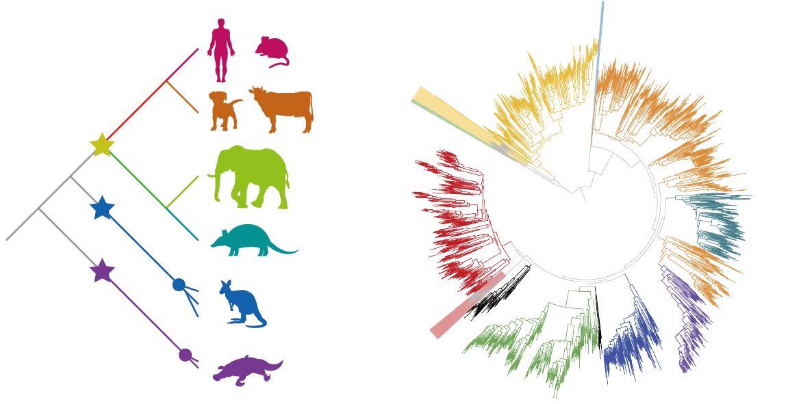
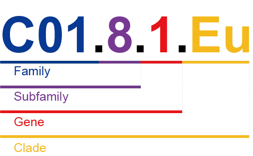

# 2.2 Accession & name

## CORD accession

In CORD, each entry has a unique identifier known as the CORD accession number. It consists of 7 alphanumerical characters in the format:

    

The CORD accession number comprises three components from left to right: the first part consists of a single english letter, indicating species information and representing the evolutionary branch from which this record originates. The specific correspondence is as follows:

| 
Single letter
 | 
Taxonomic Class
 |
| ------------------------------------------- | --------------------------------------------- |
| M                                           | Mammalia                                      |
| R                                           | Reptilia                                      |
| F                                           | Fish                                          |
| B                                           | Bird                                          |
| A                                           | Amphibia                                      |
| J                                           | Jawless fish                                  |
| L                                           | Leptocardii                                   |

The second part consists of five randomly generated alphanumeric characters, ensuring the uniqueness of the record.

The third part, composed of either F or P, indicates whether the record represents a functional gene (F) or a pseudogene (P).

Here are two examples. Accession number MJ7FR6F represents a functional olfactory receptor gene record from mammalian. Accession number FYZD26P represents a pseudogene olfactory receptor record from fish.

## Classification system

Based on species classification and molecular evolutionary information, <a target="_blank" href="https://zhaolab.shanghaitech.edu.cn/index.html">ZhaoLab</a> has developed a classification system for olfactory receptor genes in chordates. This is one of the recent research achievements of our research group. As the article has not been published yet, we are unable to disclose the details here. The classification system for olfactory receptor genes in mammals is nearing completion, and we believe it will be available to you soon.

    

The classification results for mammals have been implemented in CORD. Our classification system comprises four hierarchical levels: family, subfamily, gene, and clade. The relationships are illustrated in the diagram below:

    

