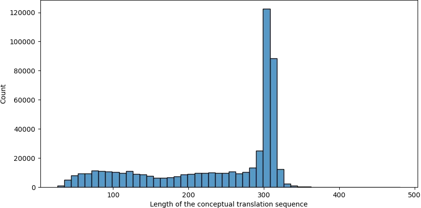

# 2.5 Conceptual translation

## Introduction

    We attempt conceptual translation for each pseudogene in CORD, and for this, extensive efforts have been made. However, approximately 1% of pseudogenes, roughly 6000 in number, remain untranslatable into protein sequences conceptually.

    Overall, we employ the fasty tool from the <a target="_blank" href="https://fasta.bioch.virginia.edu/fasta/fasta_list.html">FASTA toolkit</a> to accomplish the conceptual translation of pseudogene. When conducting conceptual translation using the fasty tool, a target database is required. In our case, we utilize protein sequences from all annotated genomes of various species, excluding redundancy. These sequences are merged and deduplicated to form the target database. The rationale behind this approach lies in the nature of conceptual translation, where the query DNA sequence is searched against the target protein database to identify the most similar sequence as a reference. The larger and more diverse the target protein database, the more helpful it is for accurate conceptual translation. Here, we provide the most comprehensive database of olfactory receptor protein sequences to date.

    

## Reference

    Pearson WR. Finding Protein and Nucleotide Similarities with FASTA. <i>Curr Protoc Bioinformatics</i>. 2016 Mar 24;53:3.9.1-3.9.25.

