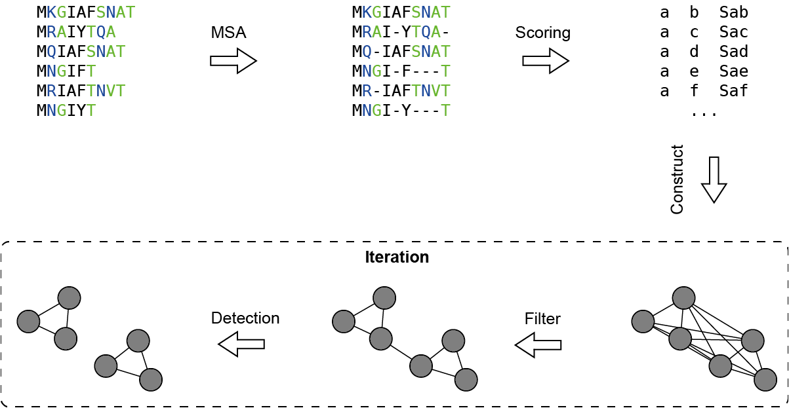

# 2.6 Community detection

## Introduction

Based on the multiple sequence alignment results of 663,380 functional olfactory receptor protein sequences from CORD, we constructed an extensive sequence similarity network. Each node in the network represents a protein sequence of an olfactory receptor, and the edges connecting any two nodes represent a certain degree of sequence similarity between these two sequences. The weight of each edge in the network describes the magnitude of similarity, utilizing a length-normalized sequence similarity score, denoted as Sxy. The calculation method is as follows:

    <svg xmlns="http://www.w3.org/2000/svg" width="187.546875" height="63.3125" role="img" focusable="false" viewBox="0 -1739.4 9668.4 2978.9" xmlns:xlink="http://www.w3.org/1999/xlink" aria-hidden="true" style="vertical-align: -2.804ex; text-align: center; color: rgb(51, 51, 51);"><defs><path id="MJX-321-TEX-I-1D446" d="M308 24Q367 24 416 76T466 197Q466 260 414 284Q308 311 278 321T236 341Q176 383 176 462Q176 523 208 573T273 648Q302 673 343 688T407 704H418H425Q521 704 564 640Q565 640 577 653T603 682T623 704Q624 704 627 704T632 705Q645 705 645 698T617 577T585 459T569 456Q549 456 549 465Q549 471 550 475Q550 478 551 494T553 520Q553 554 544 579T526 616T501 641Q465 662 419 662Q362 662 313 616T263 510Q263 480 278 458T319 427Q323 425 389 408T456 390Q490 379 522 342T554 242Q554 216 546 186Q541 164 528 137T492 78T426 18T332 -20Q320 -22 298 -22Q199 -22 144 33L134 44L106 13Q83 -14 78 -18T65 -22Q52 -22 52 -14Q52 -11 110 221Q112 227 130 227H143Q149 221 149 216Q149 214 148 207T144 186T142 153Q144 114 160 87T203 47T255 29T308 24Z"></path><path id="MJX-321-TEX-I-1D465" d="M52 289Q59 331 106 386T222 442Q257 442 286 424T329 379Q371 442 430 442Q467 442 494 420T522 361Q522 332 508 314T481 292T458 288Q439 288 427 299T415 328Q415 374 465 391Q454 404 425 404Q412 404 406 402Q368 386 350 336Q290 115 290 78Q290 50 306 38T341 26Q378 26 414 59T463 140Q466 150 469 151T485 153H489Q504 153 504 145Q504 144 502 134Q486 77 440 33T333 -11Q263 -11 227 52Q186 -10 133 -10H127Q78 -10 57 16T35 71Q35 103 54 123T99 143Q142 143 142 101Q142 81 130 66T107 46T94 41L91 40Q91 39 97 36T113 29T132 26Q168 26 194 71Q203 87 217 139T245 247T261 313Q266 340 266 352Q266 380 251 392T217 404Q177 404 142 372T93 290Q91 281 88 280T72 278H58Q52 284 52 289Z"></path><path id="MJX-321-TEX-I-1D466" d="M21 287Q21 301 36 335T84 406T158 442Q199 442 224 419T250 355Q248 336 247 334Q247 331 231 288T198 191T182 105Q182 62 196 45T238 27Q261 27 281 38T312 61T339 94Q339 95 344 114T358 173T377 247Q415 397 419 404Q432 431 462 431Q475 431 483 424T494 412T496 403Q496 390 447 193T391 -23Q363 -106 294 -155T156 -205Q111 -205 77 -183T43 -117Q43 -95 50 -80T69 -58T89 -48T106 -45Q150 -45 150 -87Q150 -107 138 -122T115 -142T102 -147L99 -148Q101 -153 118 -160T152 -167H160Q177 -167 186 -165Q219 -156 247 -127T290 -65T313 -9T321 21L315 17Q309 13 296 6T270 -6Q250 -11 231 -11Q185 -11 150 11T104 82Q103 89 103 113Q103 170 138 262T173 379Q173 380 173 381Q173 390 173 393T169 400T158 404H154Q131 404 112 385T82 344T65 302T57 280Q55 278 41 278H27Q21 284 21 287Z"></path><path id="MJX-321-TEX-N-3D" d="M56 347Q56 360 70 367H707Q722 359 722 347Q722 336 708 328L390 327H72Q56 332 56 347ZM56 153Q56 168 72 173H708Q722 163 722 153Q722 140 707 133H70Q56 140 56 153Z"></path><path id="MJX-321-TEX-N-31" d="M213 578L200 573Q186 568 160 563T102 556H83V602H102Q149 604 189 617T245 641T273 663Q275 666 285 666Q294 666 302 660V361L303 61Q310 54 315 52T339 48T401 46H427V0H416Q395 3 257 3Q121 3 100 0H88V46H114Q136 46 152 46T177 47T193 50T201 52T207 57T213 61V578Z"></path><path id="MJX-321-TEX-I-1D43F" d="M228 637Q194 637 192 641Q191 643 191 649Q191 673 202 682Q204 683 217 683Q271 680 344 680Q485 680 506 683H518Q524 677 524 674T522 656Q517 641 513 637H475Q406 636 394 628Q387 624 380 600T313 336Q297 271 279 198T252 88L243 52Q243 48 252 48T311 46H328Q360 46 379 47T428 54T478 72T522 106T564 161Q580 191 594 228T611 270Q616 273 628 273H641Q647 264 647 262T627 203T583 83T557 9Q555 4 553 3T537 0T494 -1Q483 -1 418 -1T294 0H116Q32 0 32 10Q32 17 34 24Q39 43 44 45Q48 46 59 46H65Q92 46 125 49Q139 52 144 61Q147 65 216 339T285 628Q285 635 228 637Z"></path><path id="MJX-321-TEX-LO-2211" d="M60 948Q63 950 665 950H1267L1325 815Q1384 677 1388 669H1348L1341 683Q1320 724 1285 761Q1235 809 1174 838T1033 881T882 898T699 902H574H543H251L259 891Q722 258 724 252Q725 250 724 246Q721 243 460 -56L196 -356Q196 -357 407 -357Q459 -357 548 -357T676 -358Q812 -358 896 -353T1063 -332T1204 -283T1307 -196Q1328 -170 1348 -124H1388Q1388 -125 1381 -145T1356 -210T1325 -294L1267 -449L666 -450Q64 -450 61 -448Q55 -446 55 -439Q55 -437 57 -433L590 177Q590 178 557 222T452 366T322 544L56 909L55 924Q55 945 60 948Z"></path><path id="MJX-321-TEX-I-1D456" d="M184 600Q184 624 203 642T247 661Q265 661 277 649T290 619Q290 596 270 577T226 557Q211 557 198 567T184 600ZM21 287Q21 295 30 318T54 369T98 420T158 442Q197 442 223 419T250 357Q250 340 236 301T196 196T154 83Q149 61 149 51Q149 26 166 26Q175 26 185 29T208 43T235 78T260 137Q263 149 265 151T282 153Q302 153 302 143Q302 135 293 112T268 61T223 11T161 -11Q129 -11 102 10T74 74Q74 91 79 106T122 220Q160 321 166 341T173 380Q173 404 156 404H154Q124 404 99 371T61 287Q60 286 59 284T58 281T56 279T53 278T49 278T41 278H27Q21 284 21 287Z"></path><path id="MJX-321-TEX-N-30" d="M96 585Q152 666 249 666Q297 666 345 640T423 548Q460 465 460 320Q460 165 417 83Q397 41 362 16T301 -15T250 -22Q224 -22 198 -16T137 16T82 83Q39 165 39 320Q39 494 96 585ZM321 597Q291 629 250 629Q208 629 178 597Q153 571 145 525T137 333Q137 175 145 125T181 46Q209 16 250 16Q290 16 318 46Q347 76 354 130T362 333Q362 478 354 524T321 597Z"></path><path id="MJX-321-TEX-I-1D440" d="M289 629Q289 635 232 637Q208 637 201 638T194 648Q194 649 196 659Q197 662 198 666T199 671T201 676T203 679T207 681T212 683T220 683T232 684Q238 684 262 684T307 683Q386 683 398 683T414 678Q415 674 451 396L487 117L510 154Q534 190 574 254T662 394Q837 673 839 675Q840 676 842 678T846 681L852 683H948Q965 683 988 683T1017 684Q1051 684 1051 673Q1051 668 1048 656T1045 643Q1041 637 1008 637Q968 636 957 634T939 623Q936 618 867 340T797 59Q797 55 798 54T805 50T822 48T855 46H886Q892 37 892 35Q892 19 885 5Q880 0 869 0Q864 0 828 1T736 2Q675 2 644 2T609 1Q592 1 592 11Q592 13 594 25Q598 41 602 43T625 46Q652 46 685 49Q699 52 704 61Q706 65 742 207T813 490T848 631L654 322Q458 10 453 5Q451 4 449 3Q444 0 433 0Q418 0 415 7Q413 11 374 317L335 624L267 354Q200 88 200 79Q206 46 272 46H282Q288 41 289 37T286 19Q282 3 278 1Q274 0 267 0Q265 0 255 0T221 1T157 2Q127 2 95 1T58 0Q43 0 39 2T35 11Q35 13 38 25T43 40Q45 46 65 46Q135 46 154 86Q158 92 223 354T289 629Z"></path><path id="MJX-321-TEX-N-28" d="M94 250Q94 319 104 381T127 488T164 576T202 643T244 695T277 729T302 750H315H319Q333 750 333 741Q333 738 316 720T275 667T226 581T184 443T167 250T184 58T225 -81T274 -167T316 -220T333 -241Q333 -250 318 -250H315H302L274 -226Q180 -141 137 -14T94 250Z"></path><path id="MJX-321-TEX-N-2C" d="M78 35T78 60T94 103T137 121Q165 121 187 96T210 8Q210 -27 201 -60T180 -117T154 -158T130 -185T117 -194Q113 -194 104 -185T95 -172Q95 -168 106 -156T131 -126T157 -76T173 -3V9L172 8Q170 7 167 6T161 3T152 1T140 0Q113 0 96 17Z"></path><path id="MJX-321-TEX-N-29" d="M60 749L64 750Q69 750 74 750H86L114 726Q208 641 251 514T294 250Q294 182 284 119T261 12T224 -76T186 -143T145 -194T113 -227T90 -246Q87 -249 86 -250H74Q66 -250 63 -250T58 -247T55 -238Q56 -237 66 -225Q221 -64 221 250T66 725Q56 737 55 738Q55 746 60 749Z"></path></defs><g stroke="currentColor" fill="currentColor" stroke-width="0" transform="scale(1,-1)"><g data-mml-node="math"><g data-mml-node="mtable"><g data-mml-node="mtr" transform="translate(0,6.5)"><g data-mml-node="mtd"><g data-mml-node="msub"><g data-mml-node="mi"><use data-c="1D446" href="#MJX-321-TEX-I-1D446"></use></g><g data-mml-node="TeXAtom" transform="translate(646,-150) scale(0.707)" data-mjx-texclass="ORD"><g data-mml-node="mi"><use data-c="1D465" href="#MJX-321-TEX-I-1D465"></use></g><g data-mml-node="mi" transform="translate(572,0)"><use data-c="1D466" href="#MJX-321-TEX-I-1D466"></use></g></g></g><g data-mml-node="mo" transform="translate(1724.7,0)"><use data-c="3D" href="#MJX-321-TEX-N-3D"></use></g><g data-mml-node="mfrac" transform="translate(2780.5,0)"><g data-mml-node="mn" transform="translate(310.5,676)"><use data-c="31" href="#MJX-321-TEX-N-31"></use></g><g data-mml-node="mi" transform="translate(220,-686)"><use data-c="1D43F" href="#MJX-321-TEX-I-1D43F"></use></g><rect width="881" height="60" x="120" y="220"></rect></g><g data-mml-node="mstyle" transform="translate(4068.2,0)"><g data-mml-node="munderover"><g data-mml-node="mo"><use data-c="2211" href="#MJX-321-TEX-LO-2211"></use></g><g data-mml-node="TeXAtom" transform="translate(148.2,-1087.9) scale(0.707)" data-mjx-texclass="ORD"><g data-mml-node="mi"><use data-c="1D456" href="#MJX-321-TEX-I-1D456"></use></g><g data-mml-node="mo" transform="translate(345,0)"><use data-c="3D" href="#MJX-321-TEX-N-3D"></use></g><g data-mml-node="mn" transform="translate(1123,0)"><use data-c="30" href="#MJX-321-TEX-N-30"></use></g></g><g data-mml-node="TeXAtom" transform="translate(481.2,1150) scale(0.707)" data-mjx-texclass="ORD"><g data-mml-node="mi"><use data-c="1D43F" href="#MJX-321-TEX-I-1D43F"></use></g></g></g><g data-mml-node="TeXAtom" data-mjx-texclass="ORD" transform="translate(1610.7,0)"><g data-mml-node="mi"><use data-c="1D440" href="#MJX-321-TEX-I-1D440"></use></g><g data-mml-node="mo" transform="translate(1051,0)"><use data-c="28" href="#MJX-321-TEX-N-28"></use></g><g data-mml-node="msub" transform="translate(1440,0)"><g data-mml-node="mi"><use data-c="1D465" href="#MJX-321-TEX-I-1D465"></use></g><g data-mml-node="mi" transform="translate(605,-150) scale(0.707)"><use data-c="1D456" href="#MJX-321-TEX-I-1D456"></use></g></g><g data-mml-node="mo" transform="translate(2339,0)"><use data-c="2C" href="#MJX-321-TEX-N-2C"></use></g><g data-mml-node="msub" transform="translate(2783.6,0)"><g data-mml-node="mi"><use data-c="1D466" href="#MJX-321-TEX-I-1D466"></use></g><g data-mml-node="mi" transform="translate(523,-150) scale(0.707)"><use data-c="1D456" href="#MJX-321-TEX-I-1D456"></use></g></g><g data-mml-node="mo" transform="translate(3600.6,0)"><use data-c="29" href="#MJX-321-TEX-N-29"></use></g></g></g></g></g></g></g></g></svg>

In the above formula, <i>x</i> and <i>y</i> represent two nodes in the network, which correspond to two olfactory receptor sequences after multiple sequence alignment. Here, <i>xi</i> denotes the residue or gap at position <i>i</i> in sequence <i>x</i>, and <i>yi</i> denotes the residue or gap at position <i>i</i> in sequence <i>y</i>. <i>M(xi, yi)</i> represents the element of the <i>(xi, yi)</i> residue pair in the BLOSUM80 matrix. <i>L</i> represents the length of the sequences after multiple sequence alignment, where <i>L</i> is equal to 310. For detailed information about the BLOSUM80 matrix, please <a href="#/./2-DataIntroduction/2.19-BLOSUMmatrix.md">refer to here</a>

The computational workload for constructing the CORD sequence similarity network is substantial and is carried out in three steps:

    

1. Complete multiple sequence alignment (MSA) for all CORD sequences.

2. Calculate the similarity score for each pair.

3. Convert formats to the complex network <a target="_blank" href="https://networkit.github.io/dev-docs/notebooks/IONotebook.html">Edgelist format</a>.

4. Filter out edges with low similarity scores.

5. Detection communities using the Parallel Louvain Method (PLM).

6. Iterate through steps (3), (4), and (5) to determine the appropriate similarity threshold.

In conclusion, all olfactory receptors within CORD have been categorized into 20 communities, numbered from C01 to C20. The numerical designations of these communities lack specific meanings; they serve merely as abbreviations resembling Community01. Additionally, a small subset of olfactory receptors has not been allocated to any specific community; these are uniformly assigned to C00. It is important to note that C00 does not represent a genuine community in a substantive sense.

## Reference

Henikoff S, Henikoff JG. Amino acid substitution matrices from protein blocks. <i>Proc Natl Acad Sci USA</i>. 1992;89(22):10915-10919.

Andrea Lancichinetti and Santo Fortunato. Community detection algorithms: A comparative analysis. <i>Phys. Rev.</i> E 80, 056117

Staudt Christianl, Sazonovs Aleksejs, Meyerhenke Henning. NetworKit: A tool suite for large-scale complex network analysis. <i>Network Science</i>. 2016;4(4):508-530.
