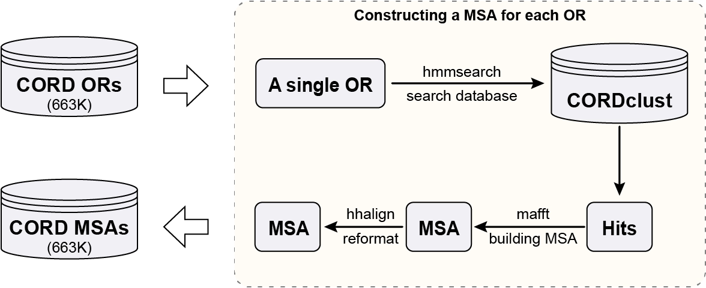
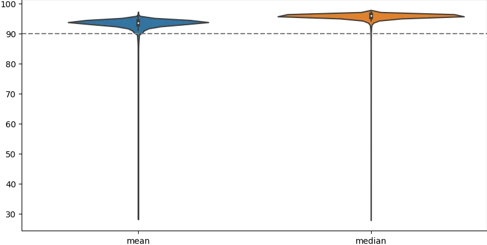
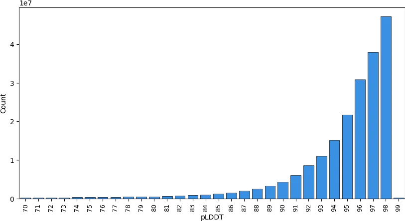

# 2.8 Receptor modelling

We employed <a target="_blank" href="https://github.com/aqlaboratory/openfold">OpenFold</a> to construct high-quality protein structure models for 663,380 functional olfactory receptors in CORD. Our construction process is outlined as follows:

## Modeling workflow

The first step involves constructing a multiple sequence alignment (MSA) for each OR.

    

* Employ [hmmsearch](http://hmmer.org/) to search the CORDclust50 database, obtaining multiple hits
* Utilize [mafft](https://mafft.cbrc.jp/alignment/software/) to build a MSA for the obtained hits
* Deploy [hhalign](https://github.com/soedinglab/hh-suite/tree/master) to convert the MSA in FASTA format to A3M format

The second step is to input the MSAs into <a target="_blank" href="https://github.com/aqlaboratory/openfold">OpenFold</a> to construct protein models. It is worth noting that we conducted extensive testing when selecting parameters for predicting olfactory receptor models. We chose 50 representative proteins from the olfactory receptor family as a test set to evaluate all neural network parameters provided by <a target="_blank" href="https://github.com/google-deepmind/alphafold">AlphaFold2</a>. The test results indicate that the quality of the olfactory receptor models constructed with the model_3_ptm parameters is significantly superior to models using other parameter sets. Consequently, we have decided to utilize the neural network parameters of model_3_ptm from AlphaFold2 for modeling functional olfactory receptors in CORD.

## Quality of protein models in CORD

OpenFold produces a per-residue estimate of its confidence on a scale from 0 - 100. This confidence measure is called pLDDT and corresponds to the model’s predicted score on the <a target="_blank" href="https://www.ncbi.nlm.nih.gov/pmc/articles/PMC3799472/">lDDT-Cα metric</a>. It is stored in the B-factor fields of the mmCIF and PDB files available for download (although unlike a B-factor, higher pLDDT is better). pLDDT is also used to colour-code the residues of the model in the 3D structure viewer. The following rules of thumb provide guidance on the expected reliability of a given region:

- 
Regions with pLDDT > 90 are expected to be modelled to high accuracy. These should be suitable for any application that benefits from high accuracy (e.g. characterising binding sites).

- 
Regions with pLDDT between 70 and 90 are expected to be modelled well (a generally good backbone prediction).

- 
Regions with pLDDT between 50 and 70 are low confidence and should be treated with caution.

- 
The 3D coordinates of regions with pLDDT < 50 often have a ribbon-like appearance and should not be interpreted. We show in our paper that pLDDT < 50 is a reasonably strong predictor of disorder, i.e. it suggests such a region is either unstructured in physiological conditions or only structured as part of a complex. (Note: this relationship has typically been tested in the context of well-studied proteins, which may have more evolutionarily-related sequences available than a randomly chosen UniProt entry.)

CORD contains 663,380 protein models, and the distribution of mean and median pLDDT values for these models is shown in the figure below.

    

If we aggregate all pLDDT scores from the 663,380 protein models and analyze their distribution collectively, the results are illustrated in the figure below.

    

## Reference

Eddy SR. Accelerated Profile HMM Searches. <i>PLoS Comput Biol</i>. 2011;7(10):e1002195.

Katoh K, Frith MC. Adding unaligned sequences into an existing alignment using MAFFT and LAST. <i>Bioinformatics</i>. 2012;28(23):3144-3146.

Steinegger M, Meier M, Mirdita M, Vöhringer H, Haunsberger SJ, Söding J. HH-suite3 for fast remote homology detection and deep protein annotation. <i>BMC Bioinformatics</i>. 2019;20(1):473. Published 2019 Sep 14.

Jumper J, Evans R, Pritzel A, et al. Highly accurate protein structure prediction with AlphaFold. <i>Nature</i>. 2021;596(7873):583-589.

